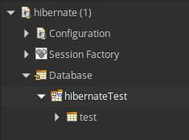

# Hibernate

**Table of contents**

- [Hibernate](#hibernate)
  - [Introduction](#introduction)
  - [Configure mysql](#configure-mysql)
    - [Install mysql](#install-mysql)
    - [Create database](#create-database)
    - [Create user](#create-user)
  - [Configure Eclipse](#configure-eclipse)
    - [Install Hibernate Tool](#install-hibernate-tool)
    - [Create Project](#create-project)
    - [Add JARs](#add-jars)
    - [Hibernate Configuration](#hibernate-configuration)

---
## Introduction
This documentation is made for linux systems and we are going to use the following software:
- Mysql database
- JDK-8
- Eclipse
- Hibernate

I will explain the installation and configuration of Mysql and Hibernate with eclipse.

If you dont have installed the JDK-8 or Eclipse, visit the following links:

[How To Install Eclipse Oxygen IDE On Ubuntu 16.04 | 17.10 | 18.04](https://websiteforstudents.com/how-to-install-eclipse-oxygen-ide-on-ubuntu-167-04-17-10-18-04/)

[How To Install Oracle JAVA JDK8 On Ubuntu 16.04 | 17.10 | 18.04 Desktops](https://websiteforstudents.com/how-to-install-oracle-java-jdk8-on-ubuntu-16-04-17-10-18-04-desktops/)

---
## Configure mysql
If you have already installed and configured Mysql database, move to the [next step](#configure-eclipse).
### Install mysql
Before starting, update the repositories of your software:
```
$ sudo apt-get update
```
Once you have all up to date, run the command:
```
$ sudo apt-get install mysql-server
```
This command will install mysql and all its dependencies into your system.

Now run secure installation utility of mysql:
```
$ sudo mysql_secure_installation utility
```
This uility will configure the mysql root password and other security options, like the remote access and the password secure level.

After the installation is complete, start the mysql service running:
```
$ sudo service mysql start
```
You can stop it and restart it using the next commands:
```
$ sudo service mysql stop
$ sudo service mysql restart
```
### Create database
Access your database by typing:
```
$ mysql -u root -p
```
- **-u** specifies the user to login with
- **-p** prompts you to insert the password of that user

The password will be the one setted at the secure installation utility.

Once you are inside mysql database, create your database:
```
CREATE DATABASE hibernate; 
```

In order to operate with that database, you must enter in it:
```
USE hibernate;
```
Now create a table inside it, lets call it contacts, and it will store an id, name and mail:
```
CREATE TABLE contacts 
(
    id INT NOT NULL PRIMARY KEY AUTO_INCREMENT,
    name VARCHAR(255) NOT NULL,
    mail VARCHAR(255) NOT NULL
);
```
### Create user
Once you have created your database, you will need an user to operate with it:
```
CREATE USER 'hibernate'@'localhost' IDENTIFIED BY 'hibernate1234';
```
You need to grant that user privileges into your database:
```
GRANT ALL PRIVILEGES ON *.* TO 'hibernate'@'localhost';
FLUSH PRIVILEGES;
```

---
## Configure Eclipse
At this part of the documentation, we are going to configure eclipse to use hibernate.
### Install Hibernate Tool
Go to `Help->Install New Software...` on the toolbar of Ecplise and add the following link:

http://download.jboss.org/jbosstools/photon/development/updates/

Select all the packages and click `Next`, accept the Apache license and click `Finish`.

To verify the installation, go to `Window->Perspective->Open Perspective->Other...`


And you may see `Hibernate` perspective there.
### Create Project
Create a new project into your workspace.
To do so, go to `File->New->Project...` and create a new `Java Project`.

Name the project `HibernateTest` and configure the JRE to javaSE-1.8 and click `Finish`.


### Add JARs
To work with hibernate you need to add two JARs to your build path project. These JARs are:
- [hibernate-core-5.1.17](docs/assets/hibernate-core-5.1.17.jar)
- [mysql-connector-java-5.1.48](docs/assets/mysql-connector-java-5.1.48.zip).

You can download them by clicking or just go to the folder docs/assets/.

Extract the mysql connector zip file.

To add the jar files to your project build path, `right click` your project root folder go to `Build path->Configure Build Path...`. In the `Libraries` tab, select `Add External JARs...` and select the files:
- `hibernate-core-5.1.17.jar`
- `mysql-connector-java-5.1.48-bin.jar`

Once both are included , click on `Apply and Close`.
Your build path should looks like this:


### Hibernate Configuration
Open the Hibernate perspective (`Window->Perspective->Open Perspective->Other...->Hibernate`).

In the Hibernate Configurations tab, click on the `+` icon (`Add Configuration...`).


`Browse...` your the project into the `Project` field.

`Setup...->Create new...` a configuration file and select HibernateTest project.


- Session factory name: `hibernateFile`
- Database dialect: `MySQL`
- Driver class: `com.mysql.jdbc.Driver`
- Connection URL: `jdbc:mysql://<host>:<port>/<database>`
  - host: localhost
  - port: 3306
  - database: hibernateTest
- Username: `hibernate`
- Password: `hibernate1234`

Once the file is configured, click `Finish` and `Apply->OK`.

